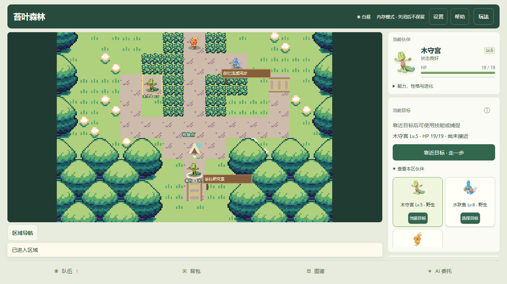
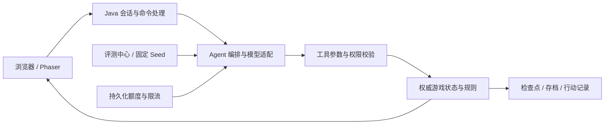

# Pokémon AI Agent Game

[](https://github.com/hannnz1/FIT2099-Pokemon-Assignment/actions/workflows/build.yml)

**在真实游戏规则中执行任务、协作与对战的 AI Agent Demo。**

玩家可以亲自探索、捕捉和培养伙伴，也可以用自然语言委托 Agent 执行任务。Java 服务端维护权威世界状态，模型通过受约束的工具行动；Phaser 浏览器界面展示实际游戏结果，评测中心记录完成情况、错误、动作轨迹和 Token 用量。

[在线冒险](https://pokemon.hanzhu-lab.online/growth/) · [AI 委托](https://pokemon.hanzhu-lab.online/quest/) · [训练师对战](https://pokemon.hanzhu-lab.online/duel/) · [评测中心](https://pokemon.hanzhu-lab.online/evaluation/)



*桌面版伙伴冒险截图，来自独立测试环境；公开站的 AI 可用性由服务端配置与剩余额度决定。*

## 从一次小冒险开始

选择木守宫、火稚鸡或水跃鱼，围绕同一只伙伴完成：

**出发 → 首次战斗 → 营地恢复 → 捕捉新伙伴 → 培养成长 → 见习训练师对战。**

方向键、WASD 或触控按钮移动，点击野生伙伴选择目标。走到已解锁入口自动切换地图，抵达营地自动恢复全队 HP、技能 PP 和异常状态。普通移动、采集和交付不扣 HP；战斗保留伤害和异常效果。完成引导后，可继续区域调查、升级进化、收藏伙伴或尝试 AI 委托。

| 入口 | 玩法 |
| --- | --- |
| `/growth/` | 伙伴冒险：区域探索、捕捉、成长、图鉴与新手引导 |
| `/quest/` | 原地图委托：采集交付、玩家协作、资源竞争与 NPC 信息转发 |
| `/training/` | 独立野生训练场：熟悉攻击、捕捉和收藏操作 |
| `/duel/` | 训练师对战：玩家对 AI、委托己方、AI 对 AI，以及回放 |
| `/evaluation/` | 选择场景、策略和 Seed，运行批次并查看结果与用量 |

## 已实现的能力

- **可执行委托**：自然语言理解、确认后执行、工具参数与游戏规则校验、暂停/取消、手动接管和有上限的失败恢复。
- **协作与竞争**：玩家与 Agent 共享目标，记录交付贡献；资源被其他角色使用后重新规划。
- **伙伴成长**：多区域探索、21 种形态、等级与进化、技能 PP、状态异常、野生刷新、队伍收藏和跨场景成长档案。
- **角色记忆**：角色私有记忆、压缩与检索、反思与日计划、带来源的信息转发。
- **V5 对战 Agent**：最多三只伙伴组队、技能与换人工具、双方隐藏选择、服务器结算、对战记录和固定 Seed 评测。对战使用队伍副本。
- **评测与恢复**：规则基线和真实模型比较，批次暂停/取消/归档/删除、动作 Trace、检查点恢复及用量记录。
- **公开调用保护**：DeepSeek 持久化 Token 账本、请求前预留与用量结算、频率/并发限制；可选邀请码身份与跨设备恢复。

## 工程设计



模型负责选择下一步动作，执行器检查当前位置、行动权、目标、库存、HP/PP 与任务限制，再修改世界状态。界面根据服务器确认后的快照和事件更新；未确认请求按原请求标识重试，避免重复执行。恢复次数、任务决策数和模型额度都有上限。

技术栈：**Java 21、Java HTTP Server、Phaser 3、原生 JavaScript/ES Modules、JUnit 5、Maven、Node Test Runner、文件存储/可选 PostgreSQL、Docker、Caddy、GitHub Actions**。模型适配包括 DeepSeek、OpenAI 和可选 Gemini；最新实网评测使用 DeepSeek。

## 本地运行

需要 **JDK 21、Maven 3.8+**；前端测试使用 **Node.js 24**。前端静态资源随仓库提供，无需先运行 npm 构建。

```bash
git clone https://github.com/hannnz1/FIT2099-Pokemon-Assignment.git
cd FIT2099-Pokemon-Assignment
mvn clean verify
```

从仓库根目录启动。以下配置使用文件存档并关闭真实模型调用，适合先体验手动玩法与免费规则基线。

**Windows PowerShell：**

```powershell
$env:LLM_PROVIDER = "disabled"
$env:AGENT_STORAGE = "file"
java -cp target/classes game.agent.web.AgentWebServer
```

**macOS / Linux：**

```bash
LLM_PROVIDER=disabled AGENT_STORAGE=file java -cp target/classes game.agent.web.AgentWebServer
```

打开 **http://127.0.0.1:8088/growth/**。其他玩法替换 URL 路径即可；按 `Ctrl+C` 停止服务。默认存档目录为 `data/agent-saves`，更新代码时应保留。`AGENT_PORT` 可修改端口，`AGENT_SAVE_DIR` 可指定存档目录。

上述类路径命令适用于默认文件存储。使用 PostgreSQL 时还需将 JDBC 运行依赖加入类路径并配置数据库，参见 [持久化设计](docs/specs/persistence-store.md)。原始控制台作业入口为 `game.Application`。

### 真实模型配置

真实调用需在服务端设置供应商及密钥后重启，浏览器不接收 API Key。仓库不包含密钥。

| 配置项 | 用途 |
| --- | --- |
| `LLM_PROVIDER=deepseek` | 启用 DeepSeek 适配 |
| `DEEPSEEK_API_KEY` | 服务端环境中的密钥 |
| `DEEPSEEK_MODEL=deepseek-flash` | 当前实测模型 |
| `AI_BUDGET_FILE` | 持久化额度账本路径；公开部署必须配置 |
| `AI_DAILY_TOKENS` / `AI_MONTHLY_TOKENS` | 日/月 Token 额度 |
| `AI_REQUESTS_PER_MINUTE` / `AI_CONCURRENCY` | 请求频率与并发限制 |
| `PUBLIC_ORIGIN` | 公开网站来源；与实际 HTTPS 域名一致 |
| `EVAL_PUBLIC_DEEPSEEK_ENABLED=true` | 公开评测中心的 DeepSeek 开关；仍受额度与身份配置限制 |

Token 额度不是货币硬限额。无有效用量回执的请求保留预留，不记作零费用；最终费用以供应商账单为准。当前额度保护面向单 JVM/单容器，多副本部署需要统一额度协调。

部署与维护参考 [公开 AI 运维说明](docs/public-ai-operations.md)、[运维脚本](deploy/tencent/operations/) 和 [四批优化验收](docs/optimization-four-batches-report.md)。这些文档保留各阶段日期，历史部署结果不代表当前实时状态。

## 最新验证与 Benchmark

以下是 **2026-10-06** 的实际记录。功能测试、游戏任务和模型调用使用不同分母，不合并为一个“全功能通过率”。

| 测试范围 | 结果 | 说明 |
| --- | --- | --- |
| Java 自动化 | **625 通过，21 跳过** | 共 646 项，0 失败/错误；跳过项需独立 PostgreSQL |
| 前端逻辑 | **220/220** | Node 内置测试框架 |
| 运维监控故障注入 | **5/5** | 不代表生产恢复演练或长时压测 |
| 三伙伴新手流程 | **3/3** | 自动流程，以原伙伴完成见习对战 |
| 桌面/窄屏操作检查 | **16/16** | 浏览器自动化；不等于真实手机验收 |
| 六场景规则基线 | **18/18 完成** | 六类场景 × Seed 11、23、37 |
| DeepSeek 实网矩阵 | **9 完成、1 格式失败、8 预算未完成** | 18 个计划案例，11 个实际发出模型请求 |

DeepSeek 六类场景均有成功样本，合计 **99 次 HTTP 请求、286,997 Token**，低于本轮授权的 300,000 Token 上限。99 次 HTTP 成功响应中有 1 次无法解码为可执行决策，HTTP 成功不等于任务成功。

有用量回执的决策平均耗时 **5.976 秒**、P95 **6.507 秒**，包含至少 6.1 秒调用间隔带来的等待，不是模型服务端纯推理延迟。预算未完成包括 7 例首请求前被拦截和 1 例中途停止，不能记作通过，也不能全部归因于模型能力。

- [全功能回归报告](benchmarks/full-benchmark-20261006/README.md) · [机器可读汇总](benchmarks/full-benchmark-20261006/summary.json)
- [DeepSeek 实网报告](benchmarks/deepseek-benchmark-20261006-513b6a5/README.md) · [逐例原始结果](benchmarks/deepseek-benchmark-20261006-513b6a5/results/) · [用量汇总](benchmarks/deepseek-benchmark-20261006-513b6a5/summary.json)
- [V5 三种对战流程验收与边界](docs/v5-battle-agent-acceptance.md)

本次 GitHub 发布前重新执行了 Java 和前端回归，结果与上表一致；CI 和部署镜像统一为 Java 21。完整验证命令：

```bash
mvn clean verify
node --test client/test/unit/*.test.mjs
python tools/test_operations_monitor.py
```

JaCoCo 报告生成于 `target/site/jacoco/index.html`。付费模型 benchmark 需单独配置密钥和预算，不属于上述免费回归。

## 已知限制与下一步

- **训练目标 ID 混用**：部分模型决策将 `captureId` 用作 `targetId`，引擎拒绝后产生额外调用；需统一观察与工具目标标识。
- **响应格式失败**：资源竞争 Seed 23 未产生可执行决策，现有记录不足以确定具体解码分支；需增加脱敏诊断并复测。
- **未完成验收**：8 个预算中止案例、21 项 PostgreSQL 集成、移动回执与缩放的专项浏览器脚本，以及真人引导、真实手机和生产耐久验收仍有缺口。
- **Demo 范围**：未实现联网 PvP、完整第三世代规则或赛事级对战策略；小样本结果不能作为生产 SLA 或稳定胜率承诺。

## 代码与文档导航

| 目录 | 内容 |
| --- | --- |
| `src/game/agent/` | Agent 编排、模型适配、工具、任务、成长、对战、评测与 Web 服务 |
| `src/game/` | 宝可梦领域规则、动作、角色、道具与地图 |
| `src/edu/monash/fit2099/engine/` | FIT2099 教学引擎 |
| `client/agent/` | 当前浏览器页面与 Phaser 交互模块 |
| `test/`、`client/test/` | Java、前端与浏览器验证 |
| `benchmarks/` | 带日期的评测报告、合成案例和截图 |
| `deploy/tencent/` | 腾讯云部署与运维脚本 |
| `docs/`、`tools/` | 设计、验收记录和独立评测工具 |

[开发历史与原始 README](README-history.md) 保留早期版本记录；其中的状态、测试数字、模型和部署说明仅适用于对应阶段。

## 项目来源与贡献

项目起点是 Monash University **FIT2099** 的团队作业，原团队成员为 **Rian Barrett、Xinwei Li、Han Zhu**。教学框架位于 `src/edu/monash/fit2099/engine/`，原作者署名（包括 Riordan D. Alfredo、Ian K. Felix）保留在源码中。

Han Zhu 在教学框架上参与宝可梦领域玩法与面向对象设计实现，后续扩展为网页游戏和 AI Agent 项目，涵盖模型编排、工具执行、协作任务、成长与对战、持久化、评测及部署。此说明不主张对教学引擎或团队作业全部文件的独占作者身份。

Phaser、参考模块及美术来源见 [第三方声明](client/THIRD_PARTY_NOTICES.md)、[素材来源](client/UPSTREAM.md) 和 [第三方许可证](third_party/)。宝可梦名称与形象属于相应权利人，本项目用于学习和作品展示，不表示拥有相关商标或商业授权。
