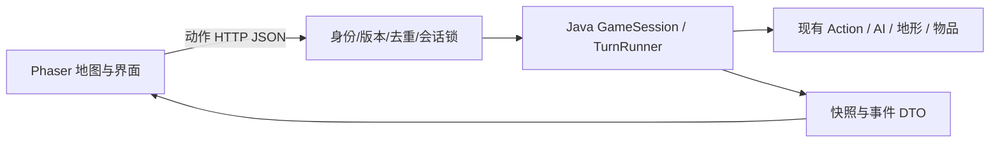

# Pokémon 引擎网页化开发规格说明书

版本：1.0｜日期：2026-09-28｜状态：待审阅，未开始产品实现

## 1. 文档目的与适用范围

本文件是“现有 Java 游戏引擎 + Phaser RPG 前端环境 + 最小素材”项目的统一开发规格，包含产品范围、规则语义、引擎修复、系统架构、接口、素材、交付阶段和验收条件。后续实现应以本文件为准。

项目源目录：`C:\Users\Administrator\Desktop\project\pokemon-game\project-main`。

本 spec 更新并优先于此前的 pokemon-web-design.md 和 pokemon-web-development-plan.md。旧文档可作历史参考；冲突时以本文件为准。特别是旧文档对精细美术的要求，不再作为首版可玩验收门槛。

本轮交付仅为规格文件，不表示引擎缺陷已修复、测试全通过或网站已部署。

### 1.1 用户已确认

- 使用现有 Java 代码作为实际游戏引擎。
- 采用 remarkablegames/phaser-rpg 的俯视角地图呈现方式和可用环境素材。
- 保留格子回合制，前端播放平滑移动动画。
- 先以最小素材接通现有 Java 玩法，再替换精细美术。
- 最终交付能够通过网页游玩的 demo。

### 1.2 本 spec 提出的首版默认值

以下属于设计建议，供本文件整体审阅，不视为用户此前逐项确认：

- 每位访客独立单人游戏，无账号、多人房间、共享世界。
- 桌面键盘与鼠标优先，中文操作界面。
- 服务端内存保存当前局；网页刷新恢复，服务重启后重新开始。
- 保留原有 client，新增 web-client，不直接覆盖旧前端。
- 首版保留现有随机判断的实际概率；集中记录与注释的差异，不顺带调整平衡。
- 精灵因任何来源降至零血量后，按统一退场流程处理；球内精灵暂停地图效果。

## 2. 产品目标与完成定义

玩家在网页地图中移动、遇见精灵、进行好感互动和捕捉、查看背包、拾取/丢弃道具、与 NPC 对话和交易，并观察野生精灵行为、昼夜以及环境变化。所有资产与规则结果来自 Java。

“完成”要求：无需控制台输入即可完成全部首版核心流程；网络重试不重复执行；不同访客互不影响；前端最终显示与 Java 一致；已确认引擎缺陷有回归测试；可以构建并部署为单实例网页服务。

### 2.1 首版玩家流程

```text
打开网页 → 开始/继续游戏 → 查看地图与操作提示
    → 移动或等待 → 精灵行动、地图更新
    → 靠近精灵 → 唱歌/跳舞/捶胸 → 好感变化
    → 捕捉可捕捉精灵 → 查看背包中的精灵球与精灵
    → 拾取 Candy → 找到商店 → 交易物品或球内 Torchic
    → 观察昼夜与环境变化 → 继续探索或重新开始
```

没有新增主线、胜利条件或强制任务。测试中的“完成体验路线”不等于新增任务系统。

### 2.2 范围矩阵

| 功能 | 首版要求 |
|---|---|
| 八方向移动与等待 | 使用 Java 合法动作；平滑格子动画 |
| 地形和占位 | 由 Ground/Location 判定；一格最多一个地图角色 |
| 三种精灵 | Treecko、Mudkip、Torchic，使用稳定种类标识 |
| 野生 AI 与地图攻击 | 保留攻击优先、游荡与元素/免疫判断 |
| 好感互动 | 三类动作、数值变化与上下限 |
| 普通捕捉 | 木守宫/水跃鱼可捕捉；地图移出并保存到球内 |
| 背包与地面物品 | 查看、拾取、丢弃、球内精灵摘要 |
| NPC 对话与交易 | 展示实际 Action，按现有价格交易 |
| 昼夜与环境 | 接通实际效果，并修复对象生命周期 |
| 刷新和重试 | 当前内存局恢复，提交幂等 |
| 最小美术 | 能识别角色、物品、地形、操作和结果即可 |

### 2.3 明确不包含

召唤/收回、好感跟随、高级球差异化捕捉、好感捕捉门槛、四技能战斗场景、升级进化、主线/道馆、永久存档、多人、完整移动端适配、精细人物动作和商业化系统。高级球可作为现有可交易物品展示，不虚构“使用高级球”操作。

## 3. 当前引擎证据与修复范围

### 3.1 验证范围

已读取启动入口、世界循环、角色/地形、Action、管理器和相关测试结构。使用 JDK 21 将当前 src 与独立诊断程序编译到工作目录并执行，原游戏源码未改动。当前命令路径未找到 Maven，本轮未运行完整 JUnit 套件。

实际诊断结果：

```text
CAPTURED_STILL_OBSERVED=true
CAPTURED_BEFORE=Mudkip(100/100)(Ap: 10) AFTER=Mudkip(85/100)(Ap: 10)
ZERO_HP_ON_MAP=true CONSCIOUS=false ACTION=MoveActorAction
REPLACED_GROUND_STILL_OBSERVED=true
LE15_PERCENT=16 EQ10_PERCENT=1
```

零血量诊断直接对角色施加伤害，再调用其 playTurn，证明该路径未阻止其返回移动动作；捕捉诊断显式执行时间管理器，证明接通昼夜后球内对象会继续受影响。二者不等于已完成网页或整个控制台流程测试。

### 3.2 首版必须修复

| ID | 根因/问题 | 要求 | 回归测试 |
|---|---|---|---|
| E01 | Application 使用普通 GameMap，日夜效果入口在 PokemonGameMap | 回合调度统一调用日夜效果，不能漏调/重复调用 | R03、R04 |
| E02 | 捕捉移除地图角色但没有停止时间观察 | 球内精灵保持数据、暂停地图 tick 与昼夜效果 | R05 |
| E03 | 替换地形未清理旧观察对象 | 只处理当前地图上的有效地形，旧地形无副作用 | R06 |
| E04 | 只有攻击路径移除零血量目标 | 统一退场，所有伤害来源适用，失去意识后不可行动 | R07 |
| E05 | 时间/好感度全局单例 | 每局独立状态，创建/关闭一局不改变其他局 | R08 |
| E06 | 控制台阻塞式输入与执行耦合 | 建局、读取、提交动作成为可调用接口 | R01、R02 |
| E07 | 身份与输出依赖对象/字符串 | 稳定实体 ID、类型化快照、动作与事件 | R09 |
| E08 | 无网页并发/重试语义 | 请求去重、版本检查、会话内串行执行 | R10、R11 |

### 3.3 明确控制的行为变化

- 原玩家先行动的规则保留。其他角色改为按会话内生成序号稳定排序，替代 HashMap 的不确定顺序。
- 昼夜效果接线修复会使原本未生效的伤害、恢复、Candy 掉落、地形变化实际发生。
- 日夜或其他伤害导致零血量时，统一进入与攻击击败相同的退场流程；地图生命周期引用一并清理。
- 血量保持在 0 至 maxHp，防止前端显示负血量；已退场角色不能被后续治疗自动放回地图。
- 捕捉/购买获得的球内精灵不参加地图 AI 或昼夜效果。

### 3.4 概率处理策略

原代码的 `nextInt(100) <= p` 对 0≤p<100 实际是 (p+1)%；`nextInt(100) == 10` 是 1%。某些生成流程按多个符合条件的邻格重复尝试，因此整个回合的生成概率也不等于单次判断概率。

首版接入统一可注入 RandomSource，但保留原比较符、尝试次数和行为分支。把实际语义写入 rules-baseline.md，测试验证边界；不对外宣称注释中的概率已实现。后续如统一成“每地形每回合一次、精确百分比”，必须作为独立规则变更提交并重新验收。

## 4. 游戏规则与回合规范

### 4.1 动作和数值

- 地图支持 N、NE、E、SE、S、SW、W、NW 八邻接，保持现有通行与对角规则。
- WAIT 消耗一个回合；打开面板、GET、刷新、动画不消耗回合。
- 喜爱互动 +10，好感不喜爱互动 -20，限制为 [-50,100]，未建立关系时显示 0。
- Treecko 喜爱跳舞；Mudkip 喜爱捶胸；Torchic 喜爱唱歌。
- Treecko/Mudkip 的现有普通捕捉不增加好感门槛或概率；Torchic 不提供野外捕捉。
- 商店：3 Candy→GreatBall；6→MasterBall；10→装有 Torchic 的普通球。
- 合法交易执行但余额不足：库存不变，仍消耗回合；仅查看商品不耗回合。
- 普通捕捉不要求消耗预先存在的普通球，沿用当前 Action 新建球的逻辑。
- 训练师免疫、NPC 的合法动作及精灵元素攻击条件以实际代码为准，不让前端自行扩大或缩小攻击菜单。

### 4.2 等待点与回合阶段

创建局：`turn=0, revision=0, phase=WAITING_FOR_PLAYER`，不推进 AI 或环境。所有有效动作回合按下列顺序原子执行：

1. 校验拥有者、requestId、expectedRevision、当前合法动作与目标状态。
2. 根据待执行回合编号 t=turn+1 确定昼夜：1–5 DAY，6–10 NIGHT，以 10 为周期。
3. 取得本轮开始时的 NPC/精灵列表，按稳定生成序号排序。
4. 玩家执行一个 Action；若多回合 Action 有后续步骤，则下一等待点仅提供对应 CONTINUE。
5. 执行尚在地图且有意识的 NPC/精灵各一次；每个 Action 后处理失去意识的对象。
6. 按固定坐标顺序执行地图地形/物品 tick；本阶段同一位置只 tick 一次。本轮新增精灵下一轮才能执行 AI。
7. 在阶段开始收集当前有效地图角色和地形；对仍在原位置的相同对象应用当前昼夜效果各一次。地形更换后旧对象跳过，新对象本阶段不递归扩散。效果获得明确 Location，不依赖可能为空或过期的缓存位置。
8. 清理失去意识的角色与失效引用；生成下一轮合法动作。
9. turn 和 revision 各加 1，发布快照与有序事件，返回等待点。若玩家退出地图或局不可恢复则 ENDED。

新生成的精灵可参与同轮阶段 7 的昼夜效果，但不参与同轮 AI；这一点须写测试固定。球内精灵不属于地图角色，不参加上述阶段。

### 4.3 生命周期不变量

- 每个地图角色仅在一个格子；每个精灵只处于地图或某个球的容器中，不同时存在两处。
- 每个实体在本局有稳定 ID；移动、捕捉、丢球、拾球不改变球内精灵 ID。
- defeated 对象：停止行动、执行原掉落规则、移出地图、移除 lastAction 和地图生命周期引用；已收集事件只保存 DTO。
- 地形替换立即终止旧地形的地图作用；构造地形样本不能注册为活跃观察者。
- 关闭游戏释放世界、观察者、请求缓存与身份关联；不能靠 reset 全局单例隔离访客。
- 无状态武器工厂可保持单例，可变会话状态必须显式归属于 GameContext。

## 5. 系统架构与工程边界



### 5.1 模块职责

| 模块 | 职责 |
|---|---|
| GameContext | 本局随机源、好感、时间、实体序号 |
| GameFactory | 从语义地图建立玩家、NPC、精灵和道具 |
| GameSession | 管理等待点、合法动作、状态版本和生命周期 |
| TurnRunner | 唯一回合调度，不依赖控制台输入 |
| AvailableActionCollector | 复用现有可用动作规则 |
| SnapshotMapper / EventCollector | 构建前端专用不可变数据 |
| SessionStore / HTTP handlers | Cookie 归属、并发、限流、去重、错误 |
| Phaser 场景与 UI | 渲染、输入、动画、状态展示；不计算玩法结果 |

保留原控制台入口并让其使用同一回合运行层，避免两套规则长期分叉。原 client 的素材/组件可以审查复用，但旧房间/WS/任务草案不约束本版接口。

### 5.2 技术基线

- Java：现有 Java 8 语法兼容，JDK 21 构建/运行，Maven、JUnit 5。
- 服务：JDK HttpServer，Jackson DTO，单实例同源部署，HTTPS 由平台或反向代理处理。
- 前端：Phaser RPG 的选定提交、TypeScript、Vite；当前读取到的上游依赖为 Phaser 4.2.1，导入时验证并锁定完整版本，不混用 Phaser 3 示例。
- 测试：JUnit、前端单元测试、Playwright 真实 Java 服务端到端测试。
- 工具版本和上游 SHA 在首个实施阶段记录并锁定；本文件不虚构尚未取得的 commit 或已安装依赖。

## 6. 数据与 HTTP 契约

### 6.1 状态定义

所有 ID 为字符串，版本/回合为非负整数；JSON 仅输出 DTO，不能自动序列化 World/Actor 的循环对象图。

```text
ActionRequest = { requestId, expectedRevision, actionId }
ActionOption = { id, kind, label, targetId?, direction?, enabled, reason? }
GameSnapshot = {
  gameId, revision, turn, phase, period, nextActionPeriod,
  map:{ id, version, width, height, grounds:[{x,y,kind}] },
  playerId, actors:[ActorState], groundItems:[{x,y,item:ItemState}],
  inventory:[ItemState], availableActions:[ActionOption], log:[LogEntry]
}
ActorState = { id,kind,name,x,y,hp,maxHp,affection?,elements:[] }
ItemState = { id,kind,name,containedPokemon?:{id,kind,name,hp,maxHp,affection} }
GameEvent = { id,revision,order,kind,actorId?,targetId?,from?,to?,amount?,message? }
LogEntry = { id,turn,text }
ActionResponse = {
  requestId,outcome:APPLIED,appliedRevision,replayed:boolean,
  snapshot:GameSnapshot,events:[GameEvent]
}
ErrorResponse = { code,message,requestId?,snapshot?:GameSnapshot }
```

period 为最近已结算轮的昼夜，初始 DAY；nextActionPeriod 为下一次有效动作使用的昼夜，供 UI 提示将发生的切换。turn 是已完成动作轮数。首版只有动作改变 revision，读取和无效提交不改变它。

ActionKind：MOVE、WAIT、SING、DANCE、CHEST_POUND、CAPTURE、TALK、TRADE、PICK_UP、DROP、ATTACK、CONTINUE。具体选项只由服务端给出。

EventKind：MOVE、SPAWN、ATTACK、MISS、HP_CHANGE、CAPTURE、REMOVE、INVENTORY_CHANGE、AFFECTION_CHANGE、DIALOGUE、TRADE、GROUND_CHANGE、PERIOD_CHANGE、LOG。

Action ID 绑定当前 revision，目标由服务端映射；客户端不得提交任意 Java 类名、坐标修改、血量或价格。目标离开、已失去意识或不再属于当前动作集时拒绝执行。

### 6.2 路由

| 方法与路径 | 行为 |
|---|---|
| POST /api/games | 创建身份和新局；已有活动局则返回该局，避免重复建局 |
| GET /api/games/current | 读取当前 Cookie 身份的局 |
| GET /api/games/{id} | 读取自己指定游戏的完整快照 |
| POST /api/games/{id}/actions | 执行一个动作回合 |
| DELETE /api/games/{id} | 结束自己的局；随后可新建，重复删除不产生副作用 |
| GET /health | 服务存活检查 |

HTTP：建局 201，返回已有局/GET/动作 200，DELETE 204；400 格式错误；404 无此局或不是拥有者；409 过期 revision 或同 requestId 不同载荷；410 已知过期局；422 非法动作；429 请求或本局动作数超限；503 容量满。合法 Action 的业务失败仍为 APPLIED，用事件/日志解释。

服务重启或过期信息不再保留时，可能返回 404；前端对 404/410 均提示该局不可继续，并提供重新开始。不向非所属身份返回快照。API 禁用浏览器缓存。

### 6.3 幂等、并发与错误

同局锁内：验证身份 → 查询 requestId → 比较载荷 → 校验 revision/动作 → 执行 → 记录结果 → 返回。去重查询先于版本检查，使响应丢失后的原请求可以恢复。

原请求重试返回原 outcome/appliedRevision 和当前快照，replayed=true；events 为空，客户端直接对齐快照，不重播旧动画。第一次成功响应包含本轮事件。前端若收到低于当前版本的响应不覆盖状态。

相同 requestId 不同载荷返回 409；同 revision 的不同并发动作只接受一个。合法执行回合即使结果为“交易不足/攻击落空”也有新版本。异常可能部分修改世界时标记局 ENDED，报告错误并要求重开，禁止不可靠的自动重试执行，不声称已经回滚。

### 6.4 会话与资源边界

Cookie 使用随机不可预测身份，HttpOnly；生产 Secure、SameSite=Lax。变更请求限定同源 Origin；JSON 请求上限 16 KiB，DELETE 不要求 JSON body。静态资源仅从发布资源白名单读取，拒绝路径穿越。

默认 30 分钟无用户交互过期、每身份一个活动局、最多 100 活动局、每局 5000 个已执行动作、每身份每秒最多 5 次动作请求。最后 200 条日志；幂等缓存保留本局至上限的紧凑请求记录，不存每步全地图历史。过期回收、限流与容量边界用注入时钟验证。

## 7. 地图与前端交互

### 7.1 地图唯一来源

技术验证先渲染现有 Java 地图；可玩 demo 使用 `maps/demo.tmj` 作为唯一编辑源，导出 Java 语义地图与 Phaser 表现地图。两者含相同 mapVersion；不一致时显示加载错误而不是继续游玩。

逻辑地形：DIRT、WALL、FLOOR、HAY、TREE、PUDDLE、WATERFALL、LAVA、CRATER。每格一个逻辑地形，另有角色、物品和装饰图层。tileSize 由地图元数据声明，缩放不改变逻辑坐标。

保留 Java Ground.canActorEnter 和占位判断；不能因为图块画成树或水就额外禁行。导出校验出生点、重复占位、类型、尺寸以及必需 NPC/互动点的可达性。三类生成区必须满足引擎周围地形条件。

静态地图放置少量初始精灵和可拾取 Candy，方便体验完整功能。这是明确的 demo 初始状态；随机生成继续保留，不通过作弊接口补物品。

动态地形变化根据快照更新，同时清除旧地形绑定的遮挡装饰。角色遮住的地形仍存在，不能只使用 getDisplayChar 的最终字符。

### 7.2 操作与界面

- WASD/方向键四方向；数字键盘和八方向屏幕按钮提供斜向；WAIT 单独按钮。
- 默认移动动画 150ms/格，可通过统一配置调整；斜向可以使用左右朝向图。
- 同时仅一个在途动作；等待服务器结果后播动画，动画结束才能重复长按，不累积无界输入队列。
- 输入状态：READY、REQUESTING、ANIMATING、ERROR、ENDED。
- 地图旁提供回合/昼夜、选中目标信息、合法动作菜单、背包、日志、重新开始与帮助。
- 背包显示物品和球内精灵，不显示不存在的召唤/高级球使用按钮。
- 文字与菜单不得从英文日志反向解析业务；kind/ID 是协议，label/message 是展示。
- 网络超时保留原 requestId 可重试；409 刷新状态；断线不切换到假状态预览。
- 长动画可跳过，直接对齐最终快照；只有服务器状态决定血量、背包与坐标。

## 8. 最小素材规格

首版允许清晰的占位图、文字和简单图形；验收要求可识别、无误导、动画与格子对齐，不要求精细美术完成。

| 项目 | 最小数量/形式 | 替换要求 |
|---|---|---|
| 玩家 | 一套可辨方向图，复用已确认可用的上游素材 | 保持脚底锚点与帧配置 |
| 三种精灵 | 各一张带名称的透明底图或不同轮廓占位图 | ID 分别为 TREECKO/MUDKIP/TORCHIC；不以其他怪物冒充官方形象 |
| 博士/商人 | 两个可区分角色 | 名称标签清楚 |
| 物品 | 普通球、高级球、大师球、Candy 共四个图标 | 形状/文字可区分，不仅靠颜色 |
| 地形 | 九种语义图块，缺失部分可用简单纹理和标记 | 与 Java kind 一对一映射 |
| 面板/血条/好感 | Phaser 或 HTML/CSS 程序绘制 | 不烘焙动态数字进图片 |
| 昼夜/捕捉/受击 | 色调、缩放、闪烁、浮动数字 | 可关闭或跳过，不改变规则 |
| 中文字体 | 系统中文字体优先 | 缺字时有后备字体 |

统一 `asset-manifest` 将逻辑 ID 映射到文件、帧、缩放和锚点，后续换美术不改 Action/API。资源缺失时使用标记明确的占位图并记录错误，不阻塞逻辑调试。

代码许可证不代表所有素材许可证。本地已有 Monster Tamer 资源部分标为发布待确认；发布包只包含已记录来源与条件的资源。上游精灵名的精细形象缺失时，首版用文字占位，不为素材问题阻塞引擎实现。

## 9. 实施阶段与文件安排

文件路径相对未来实现 checkout；下列为计划，不代表已经创建产品代码。

| 阶段 | 核心文件/模块 | 完成条件 |
|---|---|---|
| P0 基线 | docs/web-demo/rules-baseline.md、upstream.md；回归测试 | 记录版本、原测试结果、现有规则与概率；锁定工具 |
| P1 引擎修复 | GameContext、TimePerceptionManager、生命周期处理、相关 Actor/地形 | E01–E05 的失败测试变为通过 |
| P2 步进运行 | runtime/GameFactory、GameSession、TurnRunner、AvailableActionCollector | 无控制台输入可完整执行动作；顺序/昼夜可复现 |
| P3 状态与 API | web/dto、SnapshotMapper、GameHttpServer、SessionStore、WebApplication | Cookie 隔离、JSON、幂等、版本与生命周期完整 |
| P4 最小前端 | web-client/src/api、game/GridInput、EntityRenderer、EventPlayer | 真实 Java 地图、移动、等待和刷新恢复 |
| P5 完整玩法 | ui/ActionMenu、InventoryPanel、TradePanel、DialoguePanel、GameHud；地图导出 | 好感/捕捉/道具/交易/AI/环境全部可操作或观察 |
| P6 发布 | Dockerfile、CI、runbook、验收报告 | 真实服务 E2E 通过，构建容器并完成发布环境 smoke test |

主要 Java 改动覆盖：Application、World 的动作收集与循环耦合、Player 输入、Actor 只读属性与生命值边界、PokemonWorld/PokemonGameMap、好感/时间管理器、精灵/环境/商品创建路径、必要 Action 事件输出。保留 Attribution，不做无关大重构。

所有修复先有可复现失败测试，再实现最小修改，运行相关测试并检查既有测试，按独立功能提交。P4 是首个可见里程碑；在 P5 完成前不投入大规模精细素材制作。

## 10. 验收与测试

### 10.1 必须通过的验收矩阵

| ID | 验收场景 | 预期 |
|---|---|---|
| R01 | 新建/读取/等待 | 创建 turn=0；读取不变；WAIT 增加 1 |
| R02 | 八方向/碰撞 | 每次合法移动一格；无效请求不推进 |
| R03 | 日夜边界 | 第 1–5 DAY、6–10 NIGHT，UI 提示下一轮正确 |
| R04 | 日夜调用次数 | 有效角色/地形每轮一次，原图与新图一致 |
| R05 | 捕捉后时间推进 | 球内精灵 HP 与身份保留，无地图日夜伤害 |
| R06 | 地形替换 | 原对象无后续生成/扩散/掉落，新图块同步 |
| R07 | 零血量 | 攻击或环境伤害均退场，停止 AI，不发生负血量显示 |
| R08 | 双访客 | 时间、好感、库存、随机源互不影响 |
| R09 | 稳定 ID | 同种精灵可区分；移动/捕捉/拾取不会身份混淆 |
| R10 | 响应丢失/重试 | 同 requestId 只执行一次；replayed 响应不重播事件 |
| R11 | 多标签页并发 | 同版本只接受一个新动作，旧版本 409 |
| R12 | 好感 | 三种偏好 +10/-20，限制 [-50,100] |
| R13 | 捕捉种类 | 木守宫/水跃鱼可捕捉；火稚鸡无野外捕捉 |
| R14 | 道具与交易 | 拾取/丢弃同步；3/6/10 正确；余额不足无库存改变 |
| R15 | AI 与武器 | 原攻击条件与地形武器条件保持，可控随机验证命中/落空 |
| R16 | 生成与扩散 | 保留实际比较语义和尝试次数；环境变化能同步显示 |
| R17 | 纯展示 | 菜单、动画、跳过动画、刷新不影响回合和资产 |
| R18 | 未授权/过期 | 不能读写其他局；404/410 清楚提示；可重新开始 |
| R19 | 地图与资源 | mapVersion 一致；不同图层不丢失；占位资源明确可读 |
| R20 | 完整真实流程 | 实际 Java 支撑探索→互动→捕捉→背包→交易→昼夜 |
| R21 | 后续 Action | CONTINUE 没有丢失/多执行，普通操作不能绕过必要步骤 |
| R22 | 服务资源边界 | TTL、局数、动作上限、请求限流、关闭清理有效 |

### 10.2 执行方式

- Java：现有 JUnit 加回合、生命周期、状态、HTTP 集成测试；运行 `mvn clean verify`，记录实际结果。
- 随机性：注入脚本随机序列，验证边界与调用次数，不依赖“运行几百次刚好发生”。
- 前端：协议类型、输入状态机、版本比较、事件去重的单元测试与构建检查。
- 浏览器：Playwright 连接真实 Java；测试专用地图/随机源仅由测试启动器注入，生产无作弊路由。
- 网络：模拟服务器已执行但客户端没收到响应；两个独立 BrowserContext 与同身份多标签页分别测试。
- 人工：1366×768 与 1920×1080 操作完整流程，检查像素坐标、中文、遮挡、菜单和错误提示。
- 负载：20 独立会话各 100 次 WAIT，记录实际延迟与内存，无跨局污染/未处理错误；不预先宣称生产性能。

测试报告必须区分 PASS、FAIL、NOT RUN；编译通过不等于玩法通过，预写前端状态不等于引擎验收。

## 11. 部署与运维

一个 Java 实例同时提供打包静态页面与 API；前端开发可经 Vite proxy 访问本地服务。生产 HTTPS、同源 Cookie，内部监听端口由 PORT 配置；/health 供平台检查。

使用多阶段容器构建、锁文件和固定依赖。无持久数据库，禁止未经设计的多副本扩容；重启导致游戏丢失，页面必须告知。发布包不得含测试管理入口、fixture gateway 或开发源文件服务。

CI 至少包含 Java verify、前端 lint/typecheck/unit/build、核心真实 E2E。日志记录 requestId/gameId/revision 与异常位置，不记录身份 Cookie。保留上一镜像标签，回滚后同样遵守内存局丢失约定。

托管平台、域名、预算尚未指定；不影响开发与镜像验收。实际发布前使用用户指定环境和凭据，不自动购买服务。

## 12. 风险、后续扩展与交付物

### 12.1 主要风险及处理

- 开启昼夜后改变可玩节奏：使用小图、合理初始角色与 Candy，先保留数值；需要平衡调整时另列变更。
- 旧地形/精灵注册大量失效对象：先生命周期修复，再开启完整环境效果，测试回收。
- 随机生成或扩散导致地图拥挤：首版尊重现有规则，记录长局表现；不在后台悄悄删精灵或限生成。
- 当前 npm/Maven 环境可能不完整：P0 验证工具，记录实际阻碍；不能绕过测试声称成功。
- 第三方资源与上游版本变化：固定 commit 和素材清单；必要时使用原创简单占位。

### 12.2 后续独立规格

召唤/收回、跟随、高级球策略、概率统一、任务目标、永久存档与移动端分别设计。精细美术在首版行为验收后替换，保持 asset-manifest 与逻辑 ID，不改后端规则。

### 12.3 最终交付清单

- 修复后的 Java 引擎、真实 HTTP 服务和 Phaser 前端源码。
- 规则基线、接口契约、地图编辑源/导出器、素材来源及许可证清单。
- 全部 R01–R22 验收报告、测试命令与结果、关键流程截图。
- 可复现构建产物/镜像、本地启动与部署/回滚文档。
- 用户环境实际发布后的网页 URL；未发布时明确标记，不以本地截图代替线上交付。
- 已知限制：内存局、桌面优先、最小素材、未实现扩展列表。

## 13. 审阅与变更控制

本 spec 的用户确认方向见 1.1，新增默认决策见 1.2。审阅后再依照 P0–P6 实施；后续任何改变回合顺序、概率、捕捉条件、交易价格或功能范围的决定，都更新版本和对应验收项。

本版本针对最新诊断，补充生命周期和统一退场要求；保留概率兼容策略；以最小素材可玩为交付目标。文件已写成完整实现规格，尚未进行产品代码修改。

## 14. 参考与证据来源

- 本地 src/game 与 src/edu/monash/fit2099/engine 源码、本地 client/README.md 与 THIRD_PARTY_NOTICES.md。
- 本会话独立 EngineProbe 编译运行结果，见 3.1；并非完整 JUnit 验证。
- [Phaser RPG](https://github.com/remarkablegames/phaser-rpg)
- [上游地图场景](https://github.com/remarkablegames/phaser-rpg/blob/master/src/scenes/Main.tsx)
- [上游玩家移动](https://github.com/remarkablegames/phaser-rpg/blob/master/src/sprites/Player.ts)
- [上游依赖](https://github.com/remarkablegames/phaser-rpg/blob/master/package.json)
- [JDK HttpServer](https://docs.oracle.com/en/java/javase/21/docs/api/jdk.httpserver/com/sun/net/httpserver/HttpServer.html)
